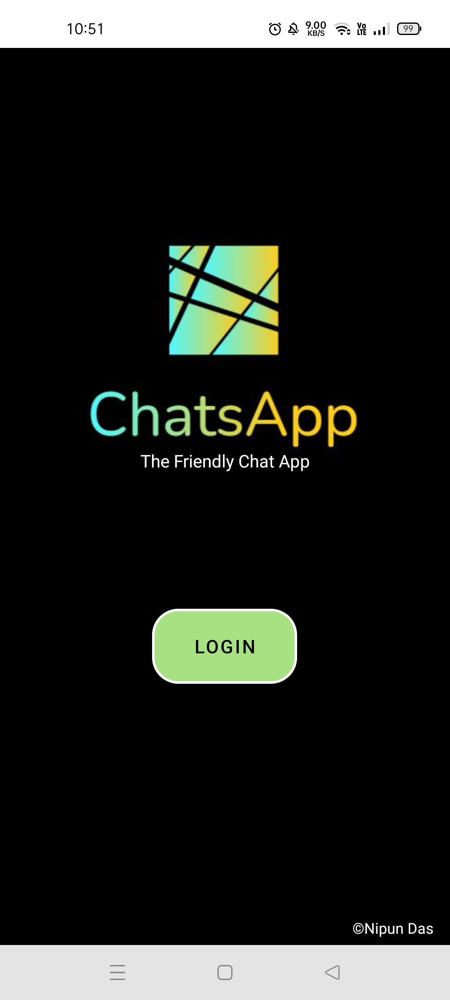
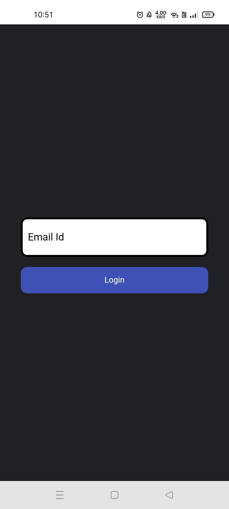
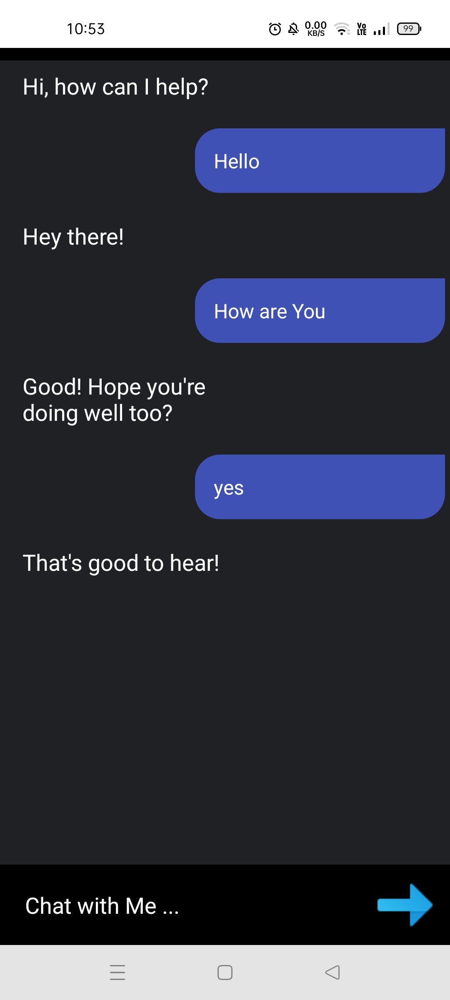
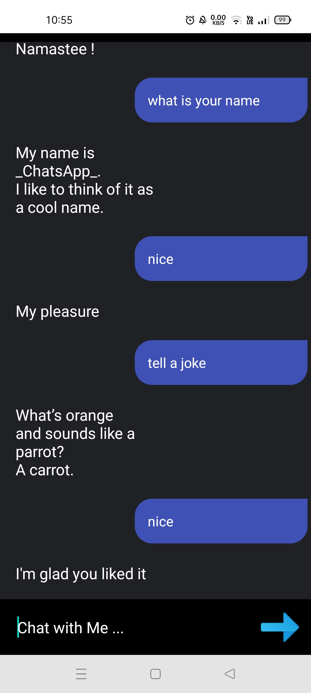

# ChatsApp

**DEVELOPER DAYS FINAL PROJECT SUBMISSION** 

- A Chat Bot App with an Elegant UI 
- Commands and Replies are stored in Objects. 
- Tried to replicate some functionalities of the Google Assistant.

The App is created as a part of Developer Days 5-week long event. 
Android Development using   

## Screenshots

  
  
  
  

## Demo Video

